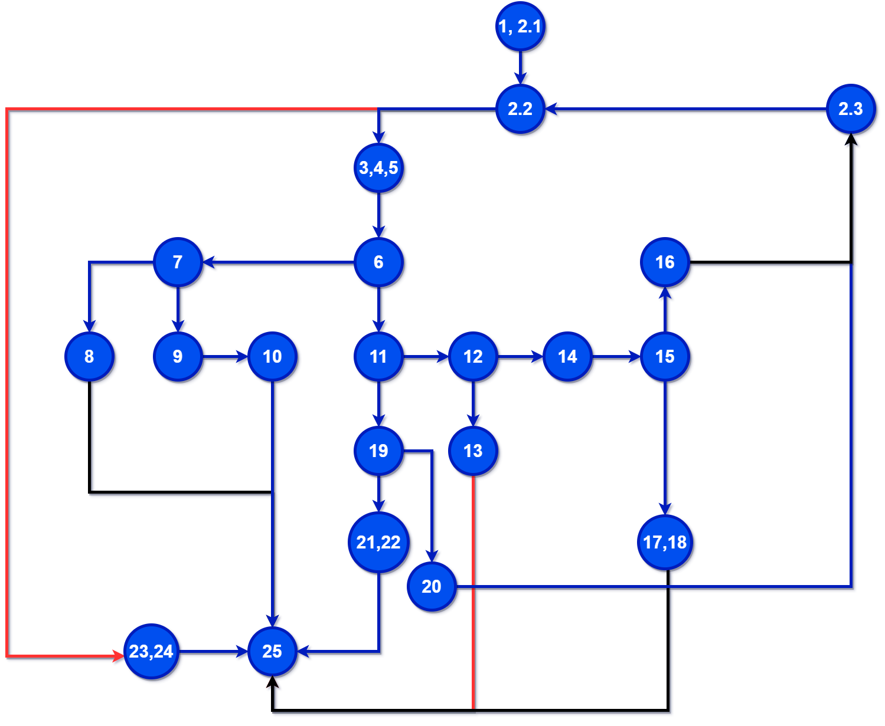
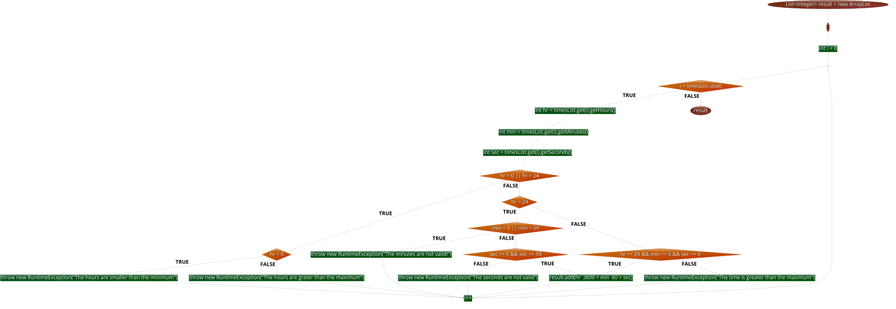
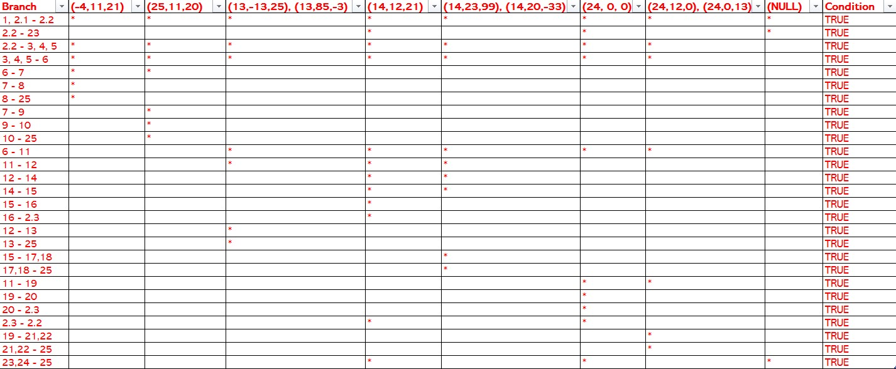

# Втора лаб. вежба по Софтверско инженерство

# Изработи: Есмир Календар, со број на индекс: 134002.

##  Control Flow Graph

Слика:

Го нацртав овој дијаграм во алатката: https://app.diagrams.net/ .

Слика: 

Овој дијаграм е граден според кодот од функцијата   public List<Integer> function(List<Time> timesList) во класата SILab2.java

## Цикломатска комплексност

Цикломатската комплексност може да ја добиеме на повеќе начини.

Прв начин: 
Преку формулата P+1=7+1=8;
P = бројот на предикатни јазли;
Добивам дека цикломатската комплексност е 8.
 
Втор начин: 
Преку формулата E-V+2=31-25+2=6+2=8;
E=број на ребра;
V=број на темиња;
Повторно добивам дека цикломатската комплексност е 8. 

## Тест случаи според доделен критериум  "Multiple condition" и објаснување за нив

Со овој доделен критериум така наречен "Multiple condition", ги анализирам само сложените if условите и else if.
Такви во оваа функција се вкупно четири.
Тие се:
if (hr < 0 || hr > 24)
if (min < 0 || min > 59)
if (sec >= 0 && sec <= 59) 
else if (hr == 24 && min == 0 && sec == 0)

За овие правам true/false комбинации според правилата што сум ги изучувал во Дискретна математика:

if (hr < 0 || hr > 24) 

T||X : (-4,11,21)
F||T : (25,11,20)
F||F : (14,12,21)

if (min < 0 || min > 59) 

T||X : (13,-13,25)
F||T : (13,85,-3)
F||F : (14,12,21)
           
if (sec >= 0 && sec <= 59)

T&&T : (14,12,21) 
F&&X : (14,20,-33)
T&&F : (14,23,99)

if (hr == 24 && min == 0 && sec == 0)

T&&F&&X : (24,12,0)
T&&T&&F : (24,0,13)
T&&T&&T : (24, 0, 0)

## Тест случаи според доделен критериум "Every branch"

Слика:
 

За разлика од претходниот доделен критериум, овој критериум така наречен "Every branch" ги поминува сите ребра во графот. 
Секое ребро треба да помине барем еднаш односно успешно да се изврши тестот.

## Објаснување на напишаните тестови за критериумот "Every branch"
  
Првиот тест "shouldThrowExceptionIfHoursSmallerThanMinimum" е за негативен саат.

Вториот тест "shouldThrowExceptionIfHoursAreGreaterThanOneDayMax" е за саати повеќе од 24.

Третиот тест "shouldThrowExceptionIfMinutesAreInvalid" е за негативни минути и за минути повеќе од 59.

Четвртиот тест "shouldSetTheValuesProperlyIfInputDataIsValid" е за ако се е исполнето.

Петиот тест "ShouldThrowExceptionIfSecondsAreNotValid" е за негативни секунди и за секунди повеќе од 59.

Шестиот тест "oneFullDayWithoutAnyExtraMinuteOrSecondsShouldBeValid" е за 24:00:00.

Седмиот тест "shouldThrowExceptionIfDataExceedsOneFullDay" е комбинации за времиња кои се со 24 часот, а со рандом минути и секунди.

Осмиот тест "IfNoTimeSetItShouldBeEqualToZero" е за null вредности.